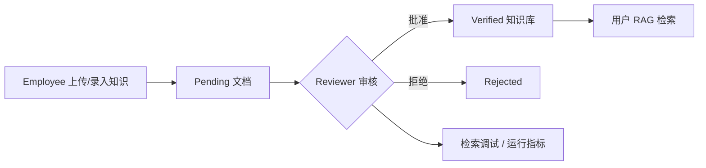

# 知天管理后台

[](https://github.com/z987645344-arch/zhitian_admin/actions/workflows/ci.yml)


知天管理后台是 [知天 Agent Platform](https://github.com/z987645344-arch/zhitian) 的企业知识治理与运行诊断界面。它没有引入重型前端框架，使用原生 HTML/CSS/JavaScript 完成员工上传、审核员确权、检索调试和请求级可观测性展示。

## 评审重点

- **知识进入检索前必须审核**：员工提交的文档保持 pending，只有 reviewer 批准后才进入用户 RAG 检索范围。
- **审核不是盲批**：审核员可以预览文档 chunk、查看转换来源，再执行批准或拒绝。
- **检索质量可直接检查**：输入 query 查看候选 source、chunk、score 和 verified/pending 状态。
- **开发者视图不与业务界面混杂**：审核模式与诊断模式互斥，支持阶段平均耗时、trace_id 明细和最近请求趋势。

## 角色工作流



### Employee

- 浏览器本地文件上传，不要求填写服务器路径。
- 支持 TXT、Markdown、PDF、DOCX，以及自动转换的 DOC/XLS/XLSX/PPT/PPTX。
- 查看本人上传文档状态并撤销 pending 文档。
- 直接录入文本知识，继续走统一审核流程。

### Reviewer

- 待审核文档预览、批准和拒绝。
- verified 文档管理与删除。
- 检索调试，可选择是否包含 pending 候选。
- 开发者视图：累计请求、模型错误分类、P50/P95/P99、阶段耗时、trace_id 查询和 SVG 趋势图。

## 技术设计

| 设计点 | 实现 |
|---|---|
| 身份认证 | JWT Bearer Token，保存在浏览器 `localStorage` |
| 角色分流 | `employee` 与 `reviewer` 登录后进入不同页面；拒绝 customer |
| API 封装 | `js/api.js` 统一注入认证头并处理 401 |
| 页面结构 | 静态 HTML，可直接打开或由任意静态服务器托管 |
| 安全显示 | 动态内容经过 HTML 转义；高风险操作提供明确交互 |
| CI | GitHub Actions 使用 Node.js 对全部 JavaScript 执行语法检查 |

## 快速运行

后端需先运行在 `http://localhost:8000`。

```powershell
git clone https://github.com/z987645344-arch/zhitian_admin.git
cd zhitian_admin
python -m http.server 8080
```

浏览器访问 `http://localhost:8080`。也可以直接打开 `index.html`；使用 HTTP 静态服务器更接近部署环境。

## 推荐评审路径

1. 用 employee 上传一份 Office 文档，确认页面提示自动转换。
2. 用 reviewer 预览并批准，确认列表展示 `converted_from`。
3. 在检索调试中查询该文档的专有名词，观察候选分数。
4. 切换开发者视图，按 trace_id 查看刚才请求的阶段耗时。

## 仓库关系

- [zhitian](https://github.com/z987645344-arch/zhitian)：FastAPI、Agent、知识库与权限后端
- [zhitian_app](https://github.com/z987645344-arch/zhitian_app)：面向终端用户的 Flutter Windows 客户端

## 已知边界

- 当前是轻量静态管理后台，不包含 SSR、前端路由框架或独立构建链。
- 指标来自后端进程内存，服务重启后清零，不跨 worker/实例聚合。
- 生产公网部署应使用 HTTPS，并根据部署环境重新评估 Token 存储策略。

## License

当前仓库未附带开源许可证，默认保留全部权利。
