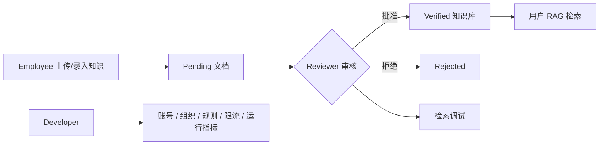

# 知天管理后台

[](https://github.com/z987645344-arch/zhitian_admin/actions/workflows/ci.yml)


知天管理后台是[知天 Agent Platform](https://github.com/z987645344-arch/zhitian)的企业知识治理与运行诊断界面。它没有引入重型前端框架，使用原生HTML/CSS/JavaScript完成员工按组织提交、审核员按组织确权、文档调用量查看，以及开发者账号、组织、系统规则、限流与请求级可观测性治理。

## 评审重点

- **知识进入检索前必须审核**：员工提交的文档保持 pending，只有 reviewer 批准后才进入用户 RAG 检索范围。
- **审核不是盲批**：审核员可以预览文档 chunk、查看转换来源，再执行批准或拒绝。
- **检索质量可直接检查**：输入 query 查看候选 source、chunk、score 和 verified/pending 状态。
- **开发者治理与业务界面分离**：独立开发者工作台负责账号、组织、系统规则、按角色限流、阶段平均耗时、trace_id明细和最近请求趋势。

## 角色工作流


```mermaid
flowchart LR
    A[Employee 上传/录入知识] --> B[Pending 文档]
    B --> C{Reviewer 审核}
    C -->|批准| D[Verified 知识库]
    C -->|拒绝| E[Rejected]
    D --> F[用户 RAG 检索]
    C --> G[检索调试]
    H[Developer] --> I[账号 / 组织 / 规则 / 限流 / 运行指标]
```

### Employee

- 浏览器本地文件上传，不要求填写服务器路径。
- 支持 TXT、Markdown、PDF、DOCX，以及自动转换的 DOC/XLS/XLSX/PPT/PPTX。
- 查看本人上传文档状态并撤销 pending 文档。
- 直接录入文本知识，继续走统一审核流程。

### Reviewer

- 从“已加入组织”下钻，只处理所属组织内的待审核和verified文档。
- 待审核文档预览、批准和拒绝；verified文档管理、调用量统计与删除。
- 检索调试，可选择是否包含 pending 候选。

### Developer

- 审批developer/reviewer注册与审核员组织申请，管理组织、成员和大厅内容。
- 编辑系统提示词模块，按角色配置对话限流，并查看企业密码和邮件发送量。
- 查看累计请求、模型错误分类、P50/P95/P99、阶段耗时、trace_id查询和SVG趋势图。

## 技术设计

| 设计点 | 实现 |
|---|---|
| 身份认证 | JWT Bearer Token，保存在浏览器 `localStorage` |
| 角色分流 | `employee`、`reviewer`与`developer`登录后进入独立页面；customer使用专用网页端或Flutter客户端 |
| API 封装 | `js/api.js` 统一注入认证头并处理 401 |
| 页面结构 | 静态HTML，可由任意静态服务器托管；默认同源`/api`需要反向代理，直接打开仅用于样式预览 |
| 安全显示 | 动态内容经过 HTML 转义；高风险操作提供明确交互 |
| CI | GitHub Actions 使用 Node.js 对全部 JavaScript 执行语法检查 |

## 快速运行

推荐通过`zhitian-deploy`仓库的Docker Compose统一入口运行，这样管理后台
使用同源`/api`即可由反向代理正确转发到后端。按部署仓库README完成配置和启动后，
访问其中`.env`里`SERVER_PUBLIC_IP`对应的入口地址。

如需在本机分别启动后端和静态站点，后端先运行在`http://localhost:8000`，并将
根目录`config.js`中的`apiBaseUrl`临时改为`http://localhost:8000`（不要把本机调试值
提交到生产分支），再启动静态服务器：

```powershell
git clone https://github.com/z987645344-arch/zhitian_admin.git
cd zhitian_admin
python -m http.server 8080
```

浏览器访问 `http://localhost:8080`。也可以直接打开 `index.html`；使用 HTTP 静态服务器更接近部署环境。

`python -m http.server`只提供静态文件，**不会**把`/api`反向代理到8000端口；若保持
`config.js`默认的同源`/api`，登录和数据请求会失败。直接打开`index.html`也只适合
检查静态布局，不能验证真实登录、组织、上传或审批功能。

## 推荐评审路径

1. 用 employee 上传一份 Office 文档，确认页面提示自动转换。
2. 用 reviewer 预览并批准，确认列表展示 `converted_from`。
3. 在检索调试中查询该文档的专有名词，观察候选分数。
4. 使用developer账号进入独立开发者工作台，按trace_id查看刚才请求的阶段耗时。

## 仓库关系

- [zhitian](https://github.com/z987645344-arch/zhitian)：FastAPI、Agent、知识库与权限后端
- [zhitian_app](https://github.com/z987645344-arch/zhitian_app)：面向终端用户的 Flutter Windows 客户端

## 已知边界

- 当前是轻量静态管理后台，不包含 SSR、前端路由框架或独立构建链。
- 指标来自后端进程内存，服务重启后清零，不跨 worker/实例聚合。
- 生产公网部署应使用 HTTPS，并根据部署环境重新评估 Token 存储策略。

## License

当前仓库未附带开源许可证，默认保留全部权利。
